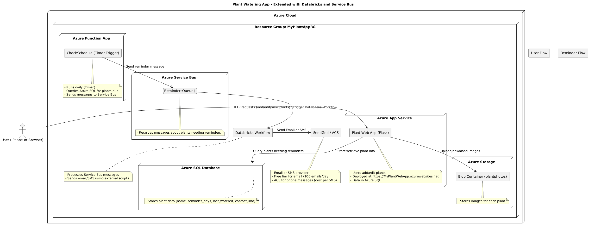

# Plant Water Reminder App

This is a simple Flask application with an HTML/JavaScript front end that lets you:
- Add a new plant (including photo)
- Specify a watering schedule

## Requirements
- Python 3.8+ recommended
- Flask

## Installation

1. Create a virtual environment (optional, but recommended):
   ```bash
   python3 -m venv venv
   source venv/bin/activate  # Mac/Linux
   # or
   venv\Scripts\activate  # Windows
   ```

2. Install the dependencies:
   ```bash
   pip install -r requirements.txt
   ```

## Usage

1. Run the application:
   ```bash
   python app.py
   ```

2. Open your browser and navigate to `http://127.0.0.1:5000/`.

## Features

- **Add Plants**: Add a plant name, upload a photo, and specify a watering frequency.
- **Watering Reminder**: Get reminders via email or SMS for watering plants.

## Architecture Diagram



## Azure Integration

- **App Service**: Hosts the Flask application.
- **Azure SQL Database**: Stores plant data.
- **Azure Blob Storage**: Stores plant images.
- **Azure Service Bus**: Manages reminder messages.
- **Databricks Workflow**: Processes reminders and sends notifications.
- **SendGrid/ACS**: Sends email or SMS reminders.

## Contribution
Feel free to fork this repository and submit pull requests for any features or bug fixes.

## License
This project is licensed under the MIT License.
